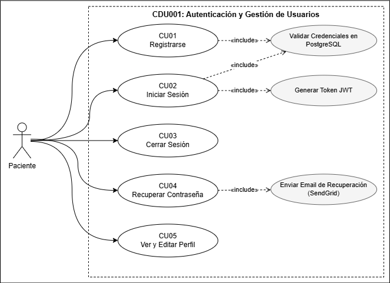
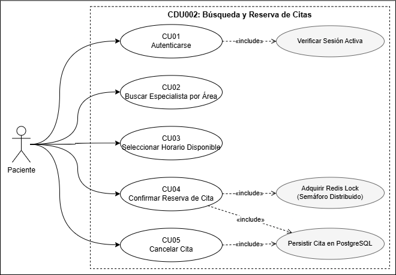
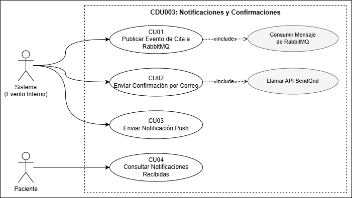
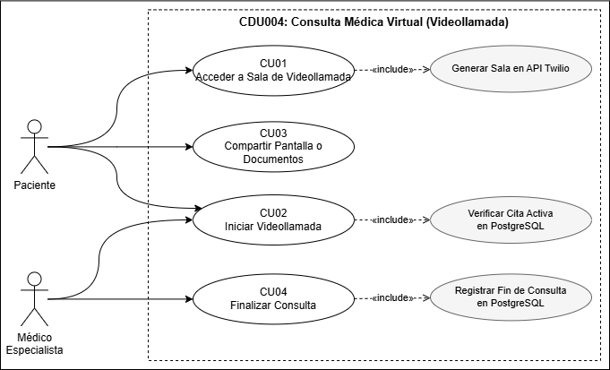
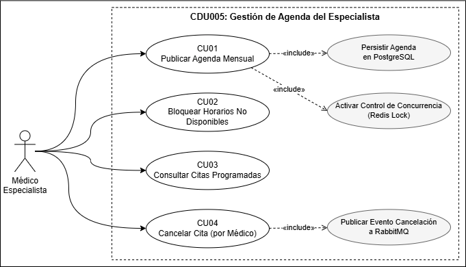
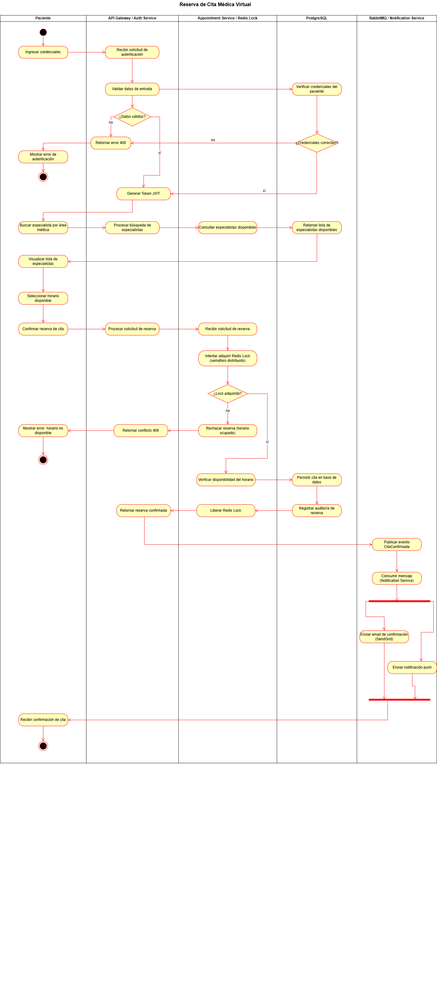
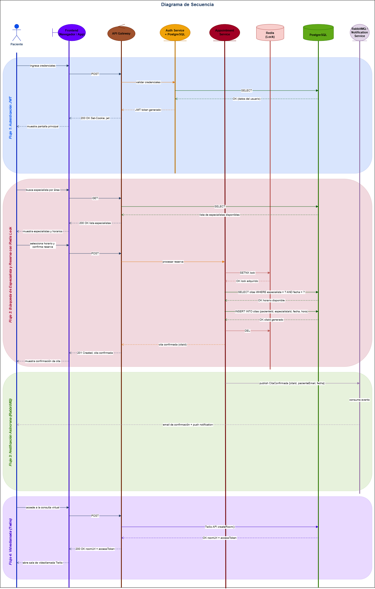
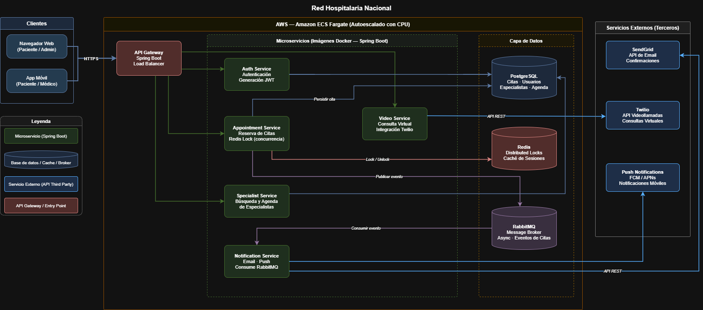
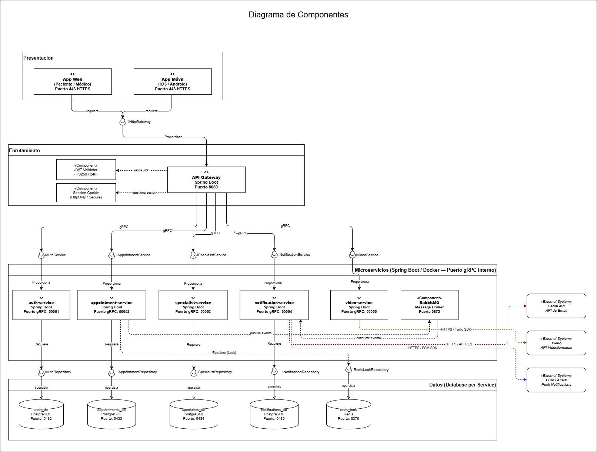

# Plataforma de Consultas Médicas Virtuales

## Integrantes

| Integrante | Nombre | Carnet | diagrama |
|---|---|---|---|
| **1** | Isai Eliezer Magdiel Molina Guevara | 202100179 | 5
| **2** | Velveth Nayely Perez Yas | 202010810 | 4
| **3** | Diego Rene Chen Teyul | 202202882 | 6
| **4** | Néstor Enrique Villatoro Avendaño (exonerado) | 202200252 | 1, 2, 3
| **5** | Angel Eduardo Tubac Simón (exonerado) | 202200309 | 7

1. Diagrama de caso de uso de alto nivel
2. Diagrama primera descomposición caso de uso
3. Caso de uso expandido (Diagrama y descripción)
4. Diagrama de actividades
5. Diagrama de secuencia
6. Diagrama de Arquitectura Alto nivel
7. Diagrama de componentes

---

# Modelo de Casos de Uso

## Diagrama de casos de uso de alto nivel

## Diagrama de primera descomposición

---

# CDU001 — Autenticación y Gestión de Usuarios

---

## CU-01 Registrarse

| **Campo** | **Detalle** |
| --- | --- |
| **Nombre** | Registrarse |
| **Código** | CU-01 |
| **Actores** | Paciente |
| **Descripción** | Permite a un nuevo paciente crear una cuenta en la plataforma. El sistema valida que el correo no esté registrado, guarda la contraseña de forma segura y crea la cuenta en estado ACTIVO. |
| **Precondiciones** | 1. El correo ingresado no tiene cuenta activa.  2. El Servicio de Autenticación está disponible. |
| **Postcondiciones** | **Éxito:** Se crea la cuenta en estado ACTIVO y la contraseña queda guardada con hash bcrypt.  **Fallo:** No se crea ningún registro si el correo ya existe o los datos son inválidos. |
| **Flujo Principal** | 1. El paciente abre el formulario de registro.  2. El paciente ingresa nombre, apellido, correo y contraseña.  3. El sistema verifica que el correo no esté registrado (<<include>> Validar Credenciales en PostgreSQL).  4. El sistema valida que la contraseña cumpla los requisitos mínimos.  5. El sistema guarda la cuenta con la contraseña hasheada con bcrypt.  6. El sistema muestra: "Cuenta creada exitosamente. Ya puedes iniciar sesión." |
| **Flujos Alternos** | **FA1: El paciente ya tiene cuenta**  FA1.1 El sistema detecta el correo duplicado en el paso 3.  FA1.2 Muestra: "Este correo ya está registrado. ¿Olvidaste tu contraseña?"  FA1.3 El flujo regresa al paso 2. |
| **Excepciones** | **E1: Correo ya registrado**  E1.1 El sistema detecta el correo duplicado en el paso 3.  E1.2 Responde con error y muestra: "Este correo ya está registrado."  E1.3 No se crea ningún registro.   **E2: Contraseña no cumple los requisitos**  E2.1 La validación del paso 4 falla.  E2.2 El sistema resalta el campo y muestra el criterio incumplido. El flujo regresa al paso 2. |
| **Reglas de Negocio** | RN01: El correo es el identificador único del paciente. No puede repetirse aunque la cuenta esté bloqueada.  RN02: La contraseña nunca se guarda ni se envía en texto visible.  RN03: La cuenta queda en estado ACTIVO inmediatamente tras el registro exitoso. |
| **Reglas de Calidad** | RC01: El sistema devuelve HTTP 201 al crear la cuenta y nunca incluye el campo contraseña en la respuesta.  RC02: Todos los campos se validan en el servidor, no solo en el navegador. |

---

## CU-02 Iniciar Sesión

| **Campo** | **Detalle** |
| --- | --- |
| **Nombre** | Iniciar Sesión |
| **Código** | CU-02 |
| **Actores** | Paciente |
| **Descripción** | El paciente con cuenta activa ingresa su correo y contraseña. El sistema los valida y genera un token de acceso JWT que permite utilizar todas las funciones protegidas de la plataforma. |
| **Precondiciones** | 1. El paciente tiene una cuenta en estado ACTIVO (completó CU-01).  2. La cuenta no está bloqueada por intentos fallidos. |
| **Postcondiciones** | **Éxito:** El sistema entrega un token JWT válido por 24 horas con los claims del usuario (id, correo, rol).  **Fallo:** No se entrega token. |
| **Flujo Principal** | 1. El paciente abre el formulario de inicio de sesión.  2. El paciente ingresa correo y contraseña.  3. El sistema verifica que ambos campos estén completos.  4. El sistema busca el usuario por correo (<<include>> Validar Credenciales en PostgreSQL).  5. El sistema compara la contraseña ingresada con el hash guardado.  6. El sistema genera el token JWT con los claims: id, correo y rol (<<include>> Generar Token JWT).  7. El sistema responde con el token. La contraseña nunca aparece en la respuesta.  8. El frontend almacena el token y redirige a la pantalla principal. |
| **Flujos Alternos** | **FA1: Intento fallido**  FA1.1 El correo no existe o la contraseña es incorrecta.  FA1.2 Muestra: "Credenciales inválidas."  FA1.3 El flujo regresa al paso 1. |
| **Excepciones** | **E1: Cuenta inexistente**  E1.1 El correo no existe en la base de datos.  E1.2 El sistema muestra el mismo mensaje genérico que FA1 para no revelar si el correo está registrado. |
| **Reglas de Negocio** | RN04: El mensaje de error ante credenciales inválidas siempre es genérico. Nunca especifica si el error está en el correo o en la contraseña.  RN05: El token JWT incluye el rol del usuario. Los demás servicios lo usan directamente sin consultar la base de datos en cada petición.  RN06: El token se almacena en sessionStorage — se pierde al cerrar el navegador o la pestaña. |
| **Reglas de Calidad** | RC03: El token JWT usa firma HS256, vence en 24 horas.  RC04: El sistema responde HTTP 401 ante credenciales inválidas.  RC05: La contraseña nunca aparece en ninguna respuesta del servidor. |

---

## CU-03 Cerrar Sesión

| **Campo** | **Detalle** |
| --- | --- |
| **Nombre** | Cerrar Sesión |
| **Código** | CU-03 |
| **Actores** | Paciente |
| **Descripción** | El paciente con sesión activa puede cerrar sesión en la plataforma. El sistema invalida el token JWT activo y redirige al usuario a la pantalla de inicio de sesión. |
| **Precondiciones** | 1. El paciente tiene sesión activa con token JWT válido (completó CU-02).  2. El token no ha vencido. |
| **Postcondiciones** | **Éxito:** El token JWT queda invalidado. El paciente es redirigido a la pantalla de inicio de sesión.  **Fallo:** Si el token ya estaba vencido, el sistema igualmente limpia la sesión local. |
| **Flujo Principal** | 1. El paciente selecciona la opción "Cerrar sesión" desde el menú.  2. El sistema invalida el token JWT activo.  3. El sistema elimina el token del almacenamiento local.  4. El sistema redirige al paciente a la pantalla de inicio de sesión. |
| **Flujos Alternos** | Ninguno. |
| **Excepciones** | **E1: Token ya expirado**  E1.1 El token ya venció antes de solicitar el cierre de sesión.  E1.2 El sistema limpia el almacenamiento local igualmente y redirige al inicio de sesión. |
| **Reglas de Negocio** | RN07: Tras cerrar sesión, cualquier petición con el token anterior debe ser rechazada con HTTP 401.  RN08: El cierre de sesión es inmediato e irrevocable — no requiere confirmación. |
| **Reglas de Calidad** | RC06: El sistema responde HTTP 200 al cerrar sesión correctamente.  RC07: La redirección a la pantalla de inicio se produce en menos de 500 ms. |

---

## CU-04 Recuperar Contraseña

| **Campo** | **Detalle** |
| --- | --- |
| **Nombre** | Recuperar Contraseña |
| **Código** | CU-04 |
| **Actores** | Paciente |
| **Descripción** | Permite al paciente restablecer su contraseña cuando la ha olvidado. El sistema envía un enlace de recuperación al correo registrado a través de SendGrid. |
| **Precondiciones** | 1. El correo ingresado tiene una cuenta activa registrada en el sistema.  2. El Servicio de Autenticación y SendGrid están disponibles. |
| **Postcondiciones** | **Éxito:** El paciente recibe un correo con un enlace de recuperación válido por 15 minutos.  **Fallo:** Si el correo no existe, el sistema muestra un mensaje genérico sin revelar esa información. |
| **Flujo Principal** | 1. El paciente selecciona "¿Olvidaste tu contraseña?" en la pantalla de inicio de sesión.  2. El paciente ingresa su correo electrónico.  3. El sistema verifica que el correo tiene una cuenta activa.  4. El sistema genera un token de recuperación con TTL de 15 minutos.  5. El sistema envía el enlace de recuperación por correo (<<include>> Enviar Email de Recuperación (SendGrid)).  6. El sistema muestra: "Si el correo está registrado, recibirás un enlace en breve."  7. El paciente accede al enlace y establece una nueva contraseña.  8. El sistema invalida el token de recuperación y actualiza la contraseña con hash bcrypt. |
| **Flujos Alternos** | **FA1: El correo no está registrado**  FA1.1 El sistema muestra el mismo mensaje genérico del paso 6 sin revelar si el correo existe o no. |
| **Excepciones** | **E1: Token de recuperación expirado**  E1.1 El paciente intenta usar el enlace tras los 15 minutos.  E1.2 El sistema muestra: "El enlace ha expirado. Solicita uno nuevo."   **E2: SendGrid no disponible**  E2.1 El envío del correo falla.  E2.2 El sistema informa: "No se pudo enviar el correo. Intenta nuevamente más tarde." |
| **Reglas de Negocio** | RN09: El token de recuperación es de un solo uso y expira en 15 minutos.  RN10: El mensaje de respuesta siempre es genérico para no revelar si el correo está registrado.  RN11: La nueva contraseña debe cumplir los mismos requisitos que en CU-01. |
| **Reglas de Calidad** | RC08: El correo de recuperación debe enviarse en menos de 30 segundos tras la solicitud.  RC09: El token de recuperación nunca aparece en la URL del frontend de forma expuesta. |

---

## CU-05 Ver y Editar Perfil

| **Campo** | **Detalle** |
| --- | --- |
| **Nombre** | Ver y Editar Perfil |
| **Código** | CU-05 |
| **Actores** | Paciente |
| **Descripción** | El paciente con sesión activa puede consultar sus datos personales y modificar los campos permitidos: nombre, apellido y teléfono. El correo no es editable desde esta pantalla. |
| **Precondiciones** | 1. El paciente tiene sesión activa con token JWT válido (completó CU-02).  2. El token no ha vencido ni fue invalidado. |
| **Postcondiciones** | **Éxito:** Los campos modificados se actualizan en la base de datos. El sistema muestra confirmación visual del cambio.  **Sin cambios:** Si el paciente no modificó ningún campo, el sistema no realiza ninguna actualización. |
| **Flujo Principal** | 1. El paciente navega a "Mi Perfil" desde el menú de su cuenta.  2. El sistema muestra el formulario con los datos precargados. El campo correo aparece deshabilitado.  3. El paciente edita uno o más campos y hace clic en "Guardar cambios".  4. El sistema valida los campos ingresados.  5. El sistema guarda los cambios en la base de datos.  6. El sistema muestra: "Cambios guardados correctamente." |
| **Flujos Alternos** | **FA1: El paciente no modifica ningún campo**  FA1.1 El paciente hace clic en "Guardar" sin cambiar nada.  FA1.2 El sistema detecta que no hay diferencias y muestra: "No hay cambios para guardar." sin actualizar la base de datos. |
| **Excepciones** | **E1: Token de acceso vencido**  E1.1 El sistema detecta el token inválido.  E1.2 Responde HTTP 401 y redirige al paciente a CU-02.   **E2: Campos inválidos**  E2.1 La validación falla (nombre o apellido vacíos, o teléfono con formato incorrecto).  E2.2 El sistema resalta el campo con error. El formulario no se borra; el paciente puede corregir. |
| **Reglas de Negocio** | RN12: El correo no puede modificarse desde este caso de uso.  RN13: El campo teléfono es opcional. Si el paciente lo deja vacío, el sistema acepta el formulario sin error. |
| **Reglas de Calidad** | RC10: La contraseña nunca aparece en ninguna respuesta del servidor en este flujo.  RC11: El sistema responde HTTP 200 con los datos actualizados del usuario.  RC12: Solo el propio paciente puede editar su perfil. Cualquier otro acceso devuelve HTTP 403. |

---

# CDU002 — Búsqueda y Reserva de Citas

---

## CU-06 Autenticarse

| **Campo** | **Detalle** |
| --- | --- |
| **Nombre** | Autenticarse |
| **Código** | CU-06 |
| **Actores** | Paciente |
| **Descripción** | El paciente verifica que tiene una sesión activa y válida antes de poder buscar especialistas o reservar citas. Si la sesión no existe o el token venció, el sistema redirige a CU-02. |
| **Precondiciones** | 1. El paciente intenta acceder a una función protegida del módulo de reservas. |
| **Postcondiciones** | **Éxito:** La sesión activa queda verificada (<<include>> Verificar Sesión Activa) y el paciente puede continuar.  **Fallo:** El paciente es redirigido a iniciar sesión. |
| **Flujo Principal** | 1. El sistema detecta que el paciente intenta acceder a una función de reservas.  2. El sistema verifica la validez del token JWT activo (<<include>> Verificar Sesión Activa).  3. Si el token es válido, el sistema permite el acceso y continúa el flujo solicitado. |
| **Flujos Alternos** | Ninguno. |
| **Excepciones** | **E1: Token vencido o inexistente**  E1.1 El sistema detecta que no hay token o que ha vencido.  E1.2 Responde HTTP 401 y redirige a CU-02.  E1.3 Tras iniciar sesión correctamente, el sistema retoma el flujo interrumpido. |
| **Reglas de Negocio** | RN01: Ninguna acción de reserva puede ejecutarse sin sesión activa válida.  RN02: La verificación es transparente para el usuario si el token es válido. |
| **Reglas de Calidad** | RC01: La verificación del token no debe añadir más de 100 ms al tiempo de respuesta total. |

---

## CU-07 Buscar Especialista por Área

| **Campo** | **Detalle** |
| --- | --- |
| **Nombre** | Buscar Especialista por Área |
| **Código** | CU-07 |
| **Actores** | Paciente |
| **Descripción** | El paciente busca médicos especialistas filtrando por área médica (ej. oncología, cardiología). El sistema devuelve la lista de especialistas disponibles con sus horarios. |
| **Precondiciones** | 1. El paciente tiene sesión activa verificada (completó CU-06).  2. El Servicio de Especialistas está disponible. |
| **Postcondiciones** | **Éxito:** Se muestra la lista de especialistas del área con nombre, especialidad y disponibilidad.  **Sin resultados:** Se muestra mensaje informativo con opción de cambiar el criterio de búsqueda. |
| **Flujo Principal** | 1. El paciente accede a la pantalla de búsqueda de especialistas.  2. El paciente selecciona o escribe un área médica en el buscador.  3. El sistema consulta los especialistas disponibles para esa área en la base de datos.  4. El sistema muestra la lista de especialistas con nombre, especialidad y próximas disponibilidades.  5. El paciente selecciona un especialista para ver sus horarios disponibles. |
| **Flujos Alternos** | **FA1: El paciente aplica filtros adicionales**  FA1.1 El paciente filtra por nombre, disponibilidad o ubicación.  FA1.2 El sistema actualiza los resultados en tiempo real. |
| **Excepciones** | **E1: No hay especialistas disponibles en el área**  E1.1 La consulta devuelve lista vacía.  E1.2 El sistema muestra: "No hay especialistas disponibles para esta área en este momento." |
| **Reglas de Negocio** | RN03: Solo se muestran especialistas con al menos un horario disponible futuro.  RN04: La búsqueda no distingue mayúsculas de minúsculas. |
| **Reglas de Calidad** | RC02: Los resultados de búsqueda deben cargarse en menos de 500 ms. |

---

## CU-08 Seleccionar Horario Disponible

| **Campo** | **Detalle** |
| --- | --- |
| **Nombre** | Seleccionar Horario Disponible |
| **Código** | CU-08 |
| **Actores** | Paciente |
| **Descripción** | El paciente visualiza los horarios disponibles del especialista seleccionado y elige el que mejor se adapta a su necesidad antes de confirmar la reserva. |
| **Precondiciones** | 1. El paciente tiene sesión activa verificada (completó CU-06).  2. El paciente seleccionó un especialista desde CU-07.  3. El especialista tiene al menos un horario disponible futuro. |
| **Postcondiciones** | **Éxito:** El horario seleccionado queda guardado en sesión para proceder a la confirmación.  **Sin disponibilidad:** El sistema informa que no hay horarios y ofrece volver a CU-07. |
| **Flujo Principal** | 1. El sistema carga la agenda del especialista con los horarios disponibles.  2. El sistema muestra el calendario de disponibilidad con fecha, hora y modalidad de consulta.  3. El paciente selecciona el horario de su preferencia.  4. El sistema guarda la selección en sesión (especialista, fecha, hora) y navega a CU-09. |
| **Flujos Alternos** | **FA1: El horario se ocupó mientras el paciente lo revisaba**  FA1.1 Al intentar seleccionar, el horario ya fue reservado por otro usuario.  FA1.2 El sistema informa del conflicto y actualiza el calendario.  FA1.3 El paciente debe elegir otro horario disponible. |
| **Excepciones** | **E1: No hay horarios disponibles**  E1.1 La agenda del especialista está completa.  E1.2 El sistema muestra: "Este especialista no tiene horarios disponibles en este momento." con opción de volver a CU-07. |
| **Reglas de Negocio** | RN05: Solo se muestran horarios con fecha y hora futura. Los horarios pasados no aparecen.  RN06: Un horario mostrado como disponible puede ser tomado por otro paciente concurrentemente — el bloqueo definitivo ocurre en CU-09. |
| **Reglas de Calidad** | RC03: El calendario de disponibilidad debe cargarse en menos de 500 ms. |

---

## CU-09 Confirmar Reserva de Cita

| **Campo** | **Detalle** |
| --- | --- |
| **Nombre** | Confirmar Reserva de Cita |
| **Código** | CU-09 |
| **Actores** | Paciente |
| **Descripción** | El paciente confirma la reserva del horario seleccionado. Es el caso crítico del módulo: el sistema adquiere un Redis Lock (semáforo distribuido) sobre el horario para evitar reservas duplicadas en situaciones de alta concurrencia, verifica disponibilidad y persiste la cita en PostgreSQL. |
| **Precondiciones** | 1. El paciente tiene sesión activa verificada (completó CU-06).  2. El paciente seleccionó un horario (completó CU-08).  3. El Servicio de Citas y Redis están disponibles. |
| **Postcondiciones** | **Éxito:** La cita queda persistida en PostgreSQL con estado CONFIRMADA. El Redis Lock es liberado. Se publica el evento para notificación.  **Fallo:** Si el lock no puede adquirirse o el horario ya fue tomado, no se crea ningún registro. |
| **Flujo Principal** | 1. El paciente hace clic en "Confirmar reserva".  2. El sistema intenta adquirir el Redis Lock sobre el horario (<<include>> Adquirir Redis Lock (Semáforo Distribuido)).  3. El sistema verifica en PostgreSQL que el horario sigue disponible.  4. El sistema persiste la cita en PostgreSQL con estado CONFIRMADA (<<include>> Persistir Cita en PostgreSQL).  5. El sistema libera el Redis Lock.  6. El sistema muestra: "Cita confirmada. Recibirás una confirmación por correo." |
| **Flujos Alternos** | Ninguno. |
| **Excepciones** | **E1: Condición de carrera — horario ya tomado**  E1.1 Otro paciente confirmó el mismo horario en el mismo instante.  E1.2 El lock no puede adquirirse o la verificación del paso 3 falla.  E1.3 El sistema informa: "Este horario ya no está disponible." y regresa a CU-08.   **E2: Redis no disponible**  E2.1 El sistema no puede adquirir el lock.  E2.2 Se rechaza la reserva con HTTP 409 y se informa al paciente que intente nuevamente. |
| **Reglas de Negocio** | RN07: El Redis Lock garantiza atomicidad — dos pacientes no pueden reservar el mismo horario simultáneamente.  RN08: El lock se libera siempre, incluso si la persistencia falla, para no bloquear el horario indefinidamente.  RN09: La confirmación es definitiva. El paciente debe cancelar desde CU-10 si desea anular. |
| **Reglas de Calidad** | RC04: La confirmación completa (lock + verificación + persistencia + liberación) debe completarse en menos de 2 segundos.  RC05: El sistema responde HTTP 201 al confirmar la cita y HTTP 409 ante conflicto de concurrencia. |

---

## CU-10 Cancelar Cita

| **Campo** | **Detalle** |
| --- | --- |
| **Nombre** | Cancelar Cita |
| **Código** | CU-10 |
| **Actores** | Paciente |
| **Descripción** | El paciente puede cancelar una cita previamente confirmada. El sistema actualiza el estado en PostgreSQL y libera el horario para que otros pacientes puedan reservarlo. |
| **Precondiciones** | 1. El paciente tiene sesión activa verificada (completó CU-06).  2. Existe al menos una cita en estado CONFIRMADA asociada al paciente.  3. La cita no ha comenzado aún. |
| **Postcondiciones** | **Éxito:** La cita queda en estado CANCELADA en PostgreSQL (<<include>> Persistir Cita en PostgreSQL). El horario queda libre para nuevas reservas.  **Fallo:** Si la cita no existe o ya fue cancelada, el sistema informa del estado actual. |
| **Flujo Principal** | 1. El paciente accede a "Mis citas" desde su perfil.  2. El sistema muestra la lista de citas activas del paciente.  3. El paciente selecciona la cita que desea cancelar y hace clic en "Cancelar cita".  4. El sistema solicita confirmación: "¿Estás seguro de que deseas cancelar esta cita?"  5. El paciente confirma la cancelación.  6. El sistema actualiza el estado de la cita a CANCELADA en PostgreSQL (<<include>> Persistir Cita en PostgreSQL).  7. El sistema muestra: "Cita cancelada correctamente." |
| **Flujos Alternos** | **FA1: El paciente cancela la acción**  FA1.1 El paciente hace clic en "No" en el paso 4.  FA1.2 El sistema cierra el diálogo sin modificar el estado de la cita. |
| **Excepciones** | **E1: La cita ya comenzó o finalizó**  E1.1 El sistema detecta que la fecha/hora de la cita ya pasó.  E1.2 Muestra: "No es posible cancelar una cita que ya ha ocurrido."   **E2: Token de acceso vencido**  E2.1 El sistema detecta el token inválido.  E2.2 Responde HTTP 401 y redirige al paciente a CU-02. |
| **Reglas de Negocio** | RN10: Solo pueden cancelarse citas en estado CONFIRMADA con fecha futura.  RN11: Al cancelar, el horario debe quedar inmediatamente disponible para otros pacientes. |
| **Reglas de Calidad** | RC06: El sistema responde HTTP 200 al cancelar correctamente y HTTP 404 si la cita no existe.  RC07: El horario liberado debe quedar disponible para nuevas reservas en menos de 1 segundo tras la cancelación. |

---

# CDU003 — Notificaciones y Confirmaciones

---

## CU-11 Publicar Evento de Cita a RabbitMQ

| **Campo** | **Detalle** |
| --- | --- |
| **Nombre** | Publicar Evento de Cita a RabbitMQ |
| **Código** | CU-11 |
| **Actores** | Sistema (Evento Interno) |
| **Descripción** | Tras confirmar o cancelar una cita, el sistema publica un evento en RabbitMQ para desencadenar de forma asíncrona el envío de notificaciones al paciente. |
| **Precondiciones** | 1. Se completó CU-09 (confirmación) o CU-10 (cancelación) exitosamente.  2. RabbitMQ está disponible. |
| **Postcondiciones** | **Éxito:** El evento queda en la cola de RabbitMQ (<<include>> Consumir Mensaje de RabbitMQ) listo para ser procesado por el Servicio de Notificaciones.  **Fallo:** El evento se registra para reintento; el flujo principal no se bloquea. |
| **Flujo Principal** | 1. El Servicio de Citas genera el evento con los datos de la cita (citaId, pacienteEmail, fecha, tipo).  2. El sistema publica el evento en el exchange de RabbitMQ.  3. RabbitMQ encola el mensaje para el Servicio de Notificaciones. |
| **Flujos Alternos** | Ninguno. |
| **Excepciones** | **E1: RabbitMQ no disponible**  E1.1 La publicación falla.  E1.2 El sistema registra el evento pendiente y reintenta de forma automática.  E1.3 El flujo principal (confirmación de cita) no se revierte por este fallo. |
| **Reglas de Negocio** | RN01: La publicación del evento es asíncrona. El paciente recibe la confirmación de cita sin esperar a que se envíe la notificación.  RN02: El sistema garantiza entrega al menos una vez (at-least-once delivery). |
| **Reglas de Calidad** | RC01: La publicación del evento no debe añadir más de 100 ms al tiempo de respuesta de la confirmación de cita. |

---

## CU-12 Enviar Confirmación por Correo

| **Campo** | **Detalle** |
| --- | --- |
| **Nombre** | Enviar Confirmación por Correo |
| **Código** | CU-12 |
| **Actores** | Sistema (Evento Interno) |
| **Descripción** | El Servicio de Notificaciones consume el evento de RabbitMQ y envía un correo electrónico de confirmación al paciente mediante la API de SendGrid. |
| **Precondiciones** | 1. Existe un evento de cita en la cola de RabbitMQ (completó CU-11).  2. SendGrid está disponible. |
| **Postcondiciones** | **Éxito:** El paciente recibe un correo con los detalles de su cita confirmada o cancelada.  **Fallo:** El evento se reencola para reintento. |
| **Flujo Principal** | 1. El Servicio de Notificaciones consume el mensaje de RabbitMQ (<<include>> Consumir Mensaje de RabbitMQ).  2. El sistema construye el cuerpo del correo con los datos de la cita.  3. El sistema llama a la API de SendGrid (<<include>> Llamar API SendGrid).  4. SendGrid entrega el correo al paciente. |
| **Flujos Alternos** | Ninguno. |
| **Excepciones** | **E1: SendGrid no disponible**  E1.1 La llamada a la API falla.  E1.2 El mensaje vuelve a la cola para reintento con backoff exponencial. |
| **Reglas de Negocio** | RN03: El correo debe enviarse en los primeros 2 minutos tras la confirmación de la cita.  RN04: Si el correo no puede entregarse tras 3 intentos, se registra el fallo para revisión manual. |
| **Reglas de Calidad** | RC02: El envío del correo debe completarse en menos de 30 segundos desde que el evento entra en la cola. |

---

## CU-13 Enviar Notificación Push

| **Campo** | **Detalle** |
| --- | --- |
| **Nombre** | Enviar Notificación Push |
| **Código** | CU-13 |
| **Actores** | Sistema (Evento Interno) |
| **Descripción** | El Servicio de Notificaciones envía una notificación push al dispositivo móvil del paciente tras consumir el evento de RabbitMQ, de forma paralela al envío del correo. |
| **Precondiciones** | 1. Existe un evento de cita en la cola de RabbitMQ (completó CU-11).  2. El paciente tiene un dispositivo con la app instalada y notificaciones habilitadas. |
| **Postcondiciones** | **Éxito:** El paciente recibe una notificación push en su dispositivo con el resumen de la cita.  **Fallo:** El sistema registra el fallo sin revertir la confirmación de la cita. |
| **Flujo Principal** | 1. El Servicio de Notificaciones consume el mensaje de RabbitMQ (<<include>> Consumir Mensaje de RabbitMQ).  2. El sistema construye el payload de la notificación push.  3. El sistema envía la notificación al dispositivo del paciente mediante FCM/APNs. |
| **Flujos Alternos** | **FA1: El paciente no tiene notificaciones habilitadas**  FA1.1 El sistema registra el intento fallido sin error visible para el usuario.  FA1.2 El correo (CU-12) sigue siendo el canal principal de notificación. |
| **Excepciones** | **E1: FCM/APNs no disponible**  E1.1 El sistema registra el fallo y no reintenta automáticamente.  E1.2 El correo electrónico actúa como canal de respaldo. |
| **Reglas de Negocio** | RN05: La notificación push es complementaria al correo, no sustituta.  RN06: El fallo en el push no afecta la confirmación de la cita ni el envío del correo. |
| **Reglas de Calidad** | RC03: La notificación push debe enviarse dentro de los primeros 60 segundos tras el evento. |

---

## CU-14 Consultar Notificaciones Recibidas

| **Campo** | **Detalle** |
| --- | --- |
| **Nombre** | Consultar Notificaciones Recibidas |
| **Código** | CU-14 |
| **Actores** | Paciente |
| **Descripción** | El paciente puede consultar el historial de notificaciones recibidas sobre sus citas directamente desde la plataforma. |
| **Precondiciones** | 1. El paciente tiene sesión activa con token JWT válido.  2. El Servicio de Notificaciones está disponible. |
| **Postcondiciones** | **Éxito:** Se muestra el listado de notificaciones del paciente ordenadas por fecha descendente.  **Sin notificaciones:** Se muestra: "No tienes notificaciones aún." |
| **Flujo Principal** | 1. El paciente accede a la sección "Notificaciones" desde su perfil.  2. El sistema consulta el historial de notificaciones asociadas al paciente.  3. El sistema muestra el listado con fecha, tipo y contenido de cada notificación.  4. El paciente puede marcar notificaciones como leídas. |
| **Flujos Alternos** | **FA1: El paciente filtra por tipo de notificación**  FA1.1 El paciente selecciona un filtro (confirmaciones, cancelaciones, recordatorios).  FA1.2 El sistema actualiza el listado según el criterio. |
| **Excepciones** | **E1: Token de acceso vencido**  E1.1 El sistema detecta el token inválido.  E1.2 Responde HTTP 401 y redirige al paciente a CU-02. |
| **Reglas de Negocio** | RN07: El historial de notificaciones se conserva por 90 días.  RN08: Las notificaciones no leídas se destacan visualmente. |
| **Reglas de Calidad** | RC04: El listado de notificaciones debe cargarse en menos de 500 ms. |

---

# CDU004 — Consulta Médica Virtual (Videollamada)

---

## CU-15 Acceder a Sala de Videollamada

| **Campo** | **Detalle** |
| --- | --- |
| **Nombre** | Acceder a Sala de Videollamada |
| **Código** | CU-15 |
| **Actores** | Paciente, Médico Especialista |
| **Descripción** | El paciente o el médico acceden a la sala de videollamada de la consulta programada. El sistema genera la sala en la API de Twilio y entrega el token de acceso a cada participante. |
| **Precondiciones** | 1. Existe una cita en estado CONFIRMADA con fecha y hora actual o próxima.  2. El Servicio de Videollamadas y la API de Twilio están disponibles. |
| **Postcondiciones** | **Éxito:** La sala de Twilio queda creada. Paciente y médico reciben sus tokens de acceso y pueden unirse a la videollamada.  **Fallo:** Si Twilio no responde, el sistema informa del error y ofrece reintentar. |
| **Flujo Principal** | 1. El paciente o el médico hacen clic en "Unirse a consulta" desde su panel.  2. El sistema verifica que existe una cita activa para ese momento (<<include>> Generar Sala en API Twilio).  3. El sistema llama a la API de Twilio para crear la sala o recuperarla si ya existe.  4. Twilio devuelve el roomUrl y el accessToken.  5. El sistema entrega el roomUrl y el accessToken al participante.  6. El frontend abre la sala de videollamada Twilio. |
| **Flujos Alternos** | **FA1: La sala ya fue creada por el otro participante**  FA1.1 El sistema recupera la sala existente en lugar de crear una nueva.  FA1.2 El participante recibe un nuevo accessToken para la sala existente. |
| **Excepciones** | **E1: Twilio no disponible**  E1.1 La llamada a la API falla.  E1.2 El sistema muestra: "No fue posible iniciar la sala. Intenta nuevamente en unos momentos."   **E2: Cita no encontrada o cancelada**  E2.1 No existe cita activa para el participante en ese momento.  E2.2 El sistema muestra: "No tienes una consulta activa en este momento." |
| **Reglas de Negocio** | RN01: La sala de Twilio se crea con el identificador único de la cita para evitar duplicados.  RN02: Los accessTokens son individuales y tienen una duración máxima de 2 horas. |
| **Reglas de Calidad** | RC01: El acceso a la sala debe habilitarse en menos de 3 segundos desde que el participante hace clic. |

---

## CU-16 Iniciar Videollamada

| **Campo** | **Detalle** |
| --- | --- |
| **Nombre** | Iniciar Videollamada |
| **Código** | CU-16 |
| **Actores** | Paciente, Médico Especialista |
| **Descripción** | Una vez dentro de la sala, el médico o el paciente inician formalmente la videollamada. El sistema verifica que la cita sigue activa en PostgreSQL antes de permitir el inicio. |
| **Precondiciones** | 1. Ambos participantes accedieron a la sala (completaron CU-15).  2. La cita sigue en estado CONFIRMADA en PostgreSQL. |
| **Postcondiciones** | **Éxito:** La videollamada queda iniciada y el estado de la cita se actualiza a EN_CURSO en PostgreSQL.  **Fallo:** Si la cita ya no está activa, el sistema bloquea el inicio y redirige. |
| **Flujo Principal** | 1. El médico hace clic en "Iniciar consulta" dentro de la sala.  2. El sistema verifica que la cita está en estado CONFIRMADA (<<include>> Verificar Cita Activa en PostgreSQL).  3. El sistema actualiza el estado de la cita a EN_CURSO en PostgreSQL.  4. La videollamada se activa para ambos participantes. |
| **Flujos Alternos** | Ninguno. |
| **Excepciones** | **E1: Cita cancelada antes de iniciar**  E1.1 El sistema detecta que la cita fue cancelada.  E1.2 Bloquea el inicio y muestra: "Esta cita fue cancelada y no puede iniciarse." |
| **Reglas de Negocio** | RN03: Solo el médico especialista puede cambiar el estado de CONFIRMADA a EN_CURSO.  RN04: Una cita no puede iniciarse si ya fue cancelada o si su hora programada pasó hace más de 30 minutos. |
| **Reglas de Calidad** | RC02: La verificación en PostgreSQL y el inicio de la videollamada deben completarse en menos de 2 segundos. |

---

## CU-17 Compartir Pantalla o Documentos

| **Campo** | **Detalle** |
| --- | --- |
| **Nombre** | Compartir Pantalla o Documentos |
| **Código** | CU-17 |
| **Actores** | Paciente, Médico Especialista |
| **Descripción** | Durante la videollamada activa, el médico o el paciente pueden compartir su pantalla o documentos clínicos relevantes con el otro participante. |
| **Precondiciones** | 1. La videollamada está en curso (completó CU-16).  2. El navegador del participante soporta la API de compartir pantalla. |
| **Postcondiciones** | **Éxito:** El contenido compartido es visible para el otro participante dentro de la sala de Twilio.  **Fallo:** El participante recibe un mensaje de error y la videollamada continúa sin interrupción. |
| **Flujo Principal** | 1. El participante hace clic en "Compartir pantalla" o "Compartir documento" dentro de la sala.  2. El navegador solicita permiso para acceder a la pantalla o al archivo.  3. El participante concede el permiso y selecciona qué compartir.  4. Twilio transmite el contenido al otro participante en tiempo real. |
| **Flujos Alternos** | **FA1: El participante detiene el compartido**  FA1.1 El participante hace clic en "Dejar de compartir".  FA1.2 La transmisión del contenido cesa. La videollamada continúa normalmente. |
| **Excepciones** | **E1: El navegador no soporta la función**  E1.1 El sistema muestra: "Tu navegador no soporta esta función. Usa Chrome o Firefox."   **E2: El participante deniega el permiso**  E2.1 El sistema cancela la operación sin afectar la videollamada. |
| **Reglas de Negocio** | RN05: Solo se puede compartir pantalla o documentos durante una videollamada en curso.  RN06: El contenido compartido no queda grabado ni almacenado en el sistema. |
| **Reglas de Calidad** | RC03: La latencia del contenido compartido no debe superar los 500 ms respecto al origen. |

---

## CU-18 Finalizar Consulta

| **Campo** | **Detalle** |
| --- | --- |
| **Nombre** | Finalizar Consulta |
| **Código** | CU-18 |
| **Actores** | Médico Especialista |
| **Descripción** | El médico finaliza formalmente la consulta virtual. El sistema actualiza el estado de la cita a FINALIZADA en PostgreSQL y cierra la sala de Twilio. |
| **Precondiciones** | 1. La videollamada está en curso (completó CU-16).  2. El actor es el Médico Especialista autenticado para esa cita. |
| **Postcondiciones** | **Éxito:** La cita queda en estado FINALIZADA en PostgreSQL (<<include>> Registrar Fin de Consulta en PostgreSQL). La sala de Twilio es cerrada. Ambos participantes son desconectados.  **Fallo:** Si el registro falla, la sala se cierra igualmente y el error queda registrado para revisión. |
| **Flujo Principal** | 1. El médico hace clic en "Finalizar consulta".  2. El sistema solicita confirmación: "¿Deseas finalizar la consulta?"  3. El médico confirma.  4. El sistema registra la hora de fin y actualiza el estado de la cita a FINALIZADA en PostgreSQL (<<include>> Registrar Fin de Consulta en PostgreSQL).  5. El sistema cierra la sala en Twilio.  6. Ambos participantes son desconectados y redirigidos a su panel de inicio. |
| **Flujos Alternos** | **FA1: El médico cancela la acción de finalizar**  FA1.1 El médico hace clic en "No" en el paso 2.  FA1.2 La videollamada continúa sin cambios. |
| **Excepciones** | **E1: Fallo al registrar en PostgreSQL**  E1.1 La actualización del estado falla.  E1.2 El sistema cierra la sala de Twilio igualmente y registra el evento para corrección manual. |
| **Reglas de Negocio** | RN07: Solo el médico especialista puede finalizar la consulta. El paciente no tiene esta opción.  RN08: Una vez finalizada, la cita no puede volver a estado EN_CURSO. |
| **Reglas de Calidad** | RC04: El registro del fin de consulta y el cierre de la sala deben completarse en menos de 3 segundos.  RC05: El sistema responde HTTP 200 al finalizar correctamente y HTTP 403 si el actor no es el médico de la cita. |

---

# CDU005 — Gestión de Agenda del Especialista

---

## CU-19 Publicar Agenda Mensual

| **Campo** | **Detalle** |
| --- | --- |
| **Nombre** | Publicar Agenda Mensual |
| **Código** | CU-19 |
| **Actores** | Médico Especialista |
| **Descripción** | El médico especialista define y publica su disponibilidad mensual. El sistema persiste la agenda en PostgreSQL y la expone como horarios disponibles para que los pacientes puedan reservar citas. |
| **Precondiciones** | 1. El médico tiene sesión activa con token JWT de rol MEDICO.  2. El Servicio de Agenda está disponible. |
| **Postcondiciones** | **Éxito:** La agenda mensual queda persistida en PostgreSQL (<<include>> Persistir Agenda en PostgreSQL) y los horarios quedan visibles para los pacientes en CU-07 y CU-08.  **Fallo:** Si la persistencia falla, no se publica ningún horario. |
| **Flujo Principal** | 1. El médico accede a "Mi Agenda" desde su panel de administración.  2. El médico selecciona el mes a configurar.  3. El médico define sus horarios disponibles (días, horas de inicio y fin, duración de cada consulta).  4. El médico hace clic en "Publicar agenda".  5. El sistema persiste la agenda en PostgreSQL (<<include>> Persistir Agenda en PostgreSQL).  6. El sistema muestra: "Agenda publicada correctamente. Los pacientes ya pueden reservar tus horarios." |
| **Flujos Alternos** | **FA1: El médico modifica una agenda ya publicada**  FA1.1 El médico edita horarios de un mes que ya tiene agenda.  FA1.2 El sistema actualiza solo los horarios sin reservas. Los horarios ya reservados no pueden modificarse. |
| **Excepciones** | **E1: Conflicto con horarios ya reservados**  E1.1 El médico intenta eliminar o modificar un horario que ya tiene una cita confirmada.  E1.2 El sistema muestra: "No puedes modificar este horario porque ya tiene una cita reservada."   **E2: Token de acceso vencido**  E2.1 El sistema detecta el token inválido.  E2.2 Responde HTTP 401 y redirige al médico a inicio de sesión. |
| **Reglas de Negocio** | RN01: Los horarios con citas confirmadas son inmutables hasta que la cita finalice o sea cancelada.  RN02: La agenda debe publicarse con al menos 24 horas de anticipación para que los horarios sean reservables. |
| **Reglas de Calidad** | RC01: La persistencia de la agenda debe completarse en menos de 2 segundos.  RC02: El sistema responde HTTP 201 al crear una agenda nueva y HTTP 200 al actualizar una existente. |

---

## CU-20 Bloquear Horarios No Disponibles

| **Campo** | **Detalle** |
| --- | --- |
| **Nombre** | Bloquear Horarios No Disponibles |
| **Código** | CU-20 |
| **Actores** | Médico Especialista |
| **Descripción** | El médico puede marcar horarios específicos como no disponibles (vacaciones, reuniones, emergencias). El sistema activa el control de concurrencia vía Redis Lock para evitar que un paciente reserve el horario mientras se está bloqueando. |
| **Precondiciones** | 1. El médico tiene sesión activa con token JWT de rol MEDICO.  2. El horario a bloquear existe en la agenda y está disponible.  3. Redis y el Servicio de Agenda están disponibles. |
| **Postcondiciones** | **Éxito:** El horario queda marcado como no disponible y no aparece como opción para los pacientes.  **Fallo:** Si el lock no puede adquirirse, el horario permanece en su estado anterior. |
| **Flujo Principal** | 1. El médico accede a su agenda y selecciona el horario a bloquear.  2. El médico selecciona "Marcar como no disponible" y confirma.  3. El sistema adquiere el Redis Lock sobre el horario (<<include>> Activar Control de Concurrencia (Redis Lock)).  4. El sistema verifica que el horario no tiene una reserva activa.  5. El sistema actualiza el estado del horario a BLOQUEADO en PostgreSQL.  6. El sistema libera el Redis Lock.  7. El sistema muestra: "Horario bloqueado correctamente." |
| **Flujos Alternos** | Ninguno. |
| **Excepciones** | **E1: El horario fue reservado justo antes de bloquearlo**  E1.1 La verificación del paso 4 detecta una cita activa.  E1.2 El sistema informa: "Este horario ya fue reservado por un paciente. No puede bloquearse."  E1.3 El lock se libera sin modificar el estado. |
| **Reglas de Negocio** | RN03: Un horario BLOQUEADO no aparece como disponible para los pacientes en ningún punto de la búsqueda.  RN04: El médico puede desbloquear un horario siempre que no tenga una cita confirmada. |
| **Reglas de Calidad** | RC03: El proceso completo de bloqueo (lock + verificación + actualización + liberación) debe completarse en menos de 1 segundo. |

---

## CU-21 Consultar Citas Programadas

| **Campo** | **Detalle** |
| --- | --- |
| **Nombre** | Consultar Citas Programadas |
| **Código** | CU-21 |
| **Actores** | Médico Especialista |
| **Descripción** | El médico puede consultar el listado completo de sus citas programadas, filtrar por fecha o estado, y ver los detalles de cada paciente para prepararse para las consultas. |
| **Precondiciones** | 1. El médico tiene sesión activa con token JWT de rol MEDICO.  2. El Servicio de Citas está disponible. |
| **Postcondiciones** | **Éxito:** Se muestra el listado de citas del médico con fecha, hora, paciente y estado.  **Sin citas:** Se muestra: "No tienes citas programadas." |
| **Flujo Principal** | 1. El médico accede a "Mis citas" desde su panel.  2. El sistema consulta las citas asociadas al médico en PostgreSQL.  3. El sistema muestra el listado con fecha, hora, nombre del paciente y estado de cada cita.  4. El médico puede hacer clic en una cita para ver el detalle completo del paciente. |
| **Flujos Alternos** | **FA1: El médico filtra por fecha o estado**  FA1.1 El médico aplica un filtro de fecha (hoy, próxima semana, mes) o por estado (CONFIRMADA, FINALIZADA, CANCELADA).  FA1.2 El sistema actualiza el listado en tiempo real. |
| **Excepciones** | **E1: Token de acceso vencido**  E1.1 El sistema detecta el token inválido.  E1.2 Responde HTTP 401 y redirige al médico a inicio de sesión. |
| **Reglas de Negocio** | RN05: El médico solo puede ver sus propias citas. El acceso a citas de otros médicos devuelve HTTP 403.  RN06: Las citas se muestran ordenadas por fecha ascendente de forma predeterminada. |
| **Reglas de Calidad** | RC04: El listado de citas debe cargarse en menos de 500 ms. |

---

## CU-22 Cancelar Cita (por Médico)

| **Campo** | **Detalle** |
| --- | --- |
| **Nombre** | Cancelar Cita (por Médico) |
| **Código** | CU-22 |
| **Actores** | Médico Especialista |
| **Descripción** | El médico puede cancelar una cita confirmada por causas justificadas (emergencia, enfermedad). El sistema actualiza el estado en PostgreSQL y publica un evento en RabbitMQ para notificar al paciente de la cancelación. |
| **Precondiciones** | 1. El médico tiene sesión activa con token JWT de rol MEDICO.  2. La cita a cancelar existe en estado CONFIRMADA y está asociada al médico. |
| **Postcondiciones** | **Éxito:** La cita queda en estado CANCELADA en PostgreSQL. Se publica un evento de cancelación en RabbitMQ (<<include>> Publicar Evento Cancelación a RabbitMQ) para notificar al paciente. El horario queda libre para nuevas reservas.  **Fallo:** Si la persistencia falla, la cita permanece en estado CONFIRMADA. |
| **Flujo Principal** | 1. El médico accede a la cita que desea cancelar desde CU-21.  2. El médico selecciona "Cancelar cita" e ingresa el motivo de cancelación.  3. El sistema solicita confirmación.  4. El médico confirma la cancelación.  5. El sistema actualiza el estado de la cita a CANCELADA en PostgreSQL.  6. El sistema publica el evento de cancelación en RabbitMQ (<<include>> Publicar Evento Cancelación a RabbitMQ) para que el Servicio de Notificaciones informe al paciente.  7. El sistema muestra: "Cita cancelada. El paciente será notificado." |
| **Flujos Alternos** | **FA1: El médico cancela la acción**  FA1.1 El médico hace clic en "No" en el paso 3.  FA1.2 El sistema cierra el diálogo sin modificar el estado de la cita. |
| **Excepciones** | **E1: La cita ya comenzó**  E1.1 El sistema detecta que la cita está en estado EN_CURSO.  E1.2 Muestra: "No puedes cancelar una consulta que ya está en curso. Usa la opción Finalizar Consulta."   **E2: Fallo al publicar en RabbitMQ**  E2.1 La publicación del evento falla.  E2.2 La cancelación en PostgreSQL se conserva. El sistema reintenta la publicación del evento automáticamente. |
| **Reglas de Negocio** | RN07: El médico debe ingresar un motivo de cancelación. El campo es obligatorio.  RN08: Al cancelar, el horario queda inmediatamente disponible para que otros pacientes puedan reservarlo.  RN09: El paciente debe recibir la notificación de cancelación en un máximo de 5 minutos tras la acción del médico. |
| **Reglas de Calidad** | RC05: El sistema responde HTTP 200 al cancelar correctamente.  RC06: El evento de cancelación debe publicarse en RabbitMQ en menos de 500 ms tras actualizar el estado en PostgreSQL. |
---

# Diagrama de actividades

---

# Diagrama de secuencia

---

# Diagrama de Arquitectura Alto nivel

---

# Diagrama de componentes

