# Plataforma de Consultas Médicas Virtuales

## Integrantes

| Integrante | Nombre | Carnet | diagrama |
|---|---|---|---|
| **1** | Isai Eliezer Magdiel Molina Guevara | 202100179 | 2
| **2** | Velveth Nayely Perez Yas | 202010810 | 3
| **3** | Diego Rene Chen Teyul | 202202882 | 4, 5
| **4** | Néstor Enrique Villatoro Avendaño (exonerado) | 202200252 | 6, 7
| **5** | Angel Eduardo Tubac Simón (exonerado) | 202200309 | 1

1. Diagrama de Arquitectura de alto nivel
2. Diagramas de secuencias
3. Diagrama de actividades
4. Diagrama de Paquetes
5. Diagrama de componentes
6. Casos de uso expandidos (Solo diagrama)
7. Justificación de tecnologías respondiendo ¿Qué?, ¿Por qué? y ¿Para qué?

---

# Modelo de Casos de Uso

## Diagrama de casos de uso de alto nivel

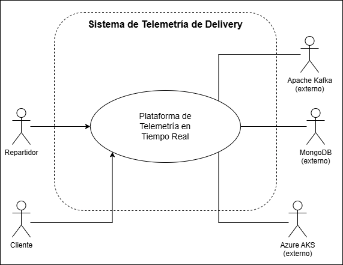

## Diagrama de primera descomposición

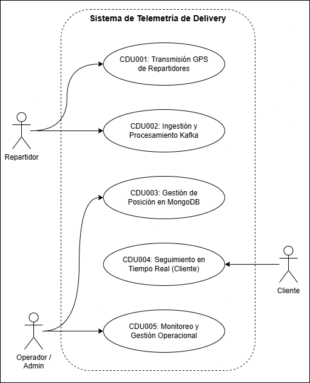

---

# CDU001 — Autenticación y Gestión de Usuarios

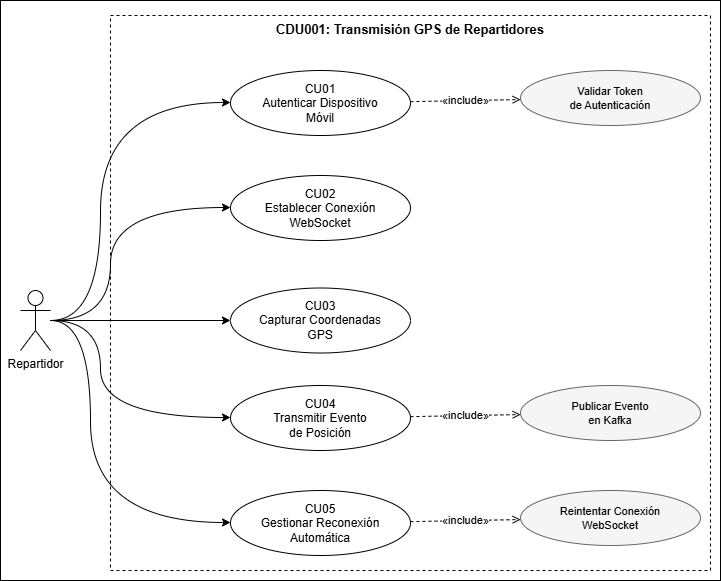

---

# CDU002 — Búsqueda y Reserva de Citas

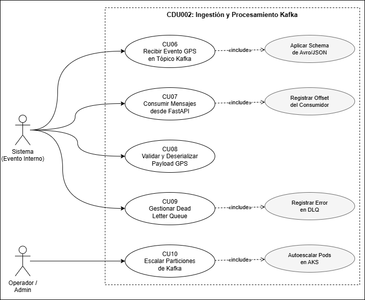

---

# CDU003 — Notificaciones y Confirmaciones

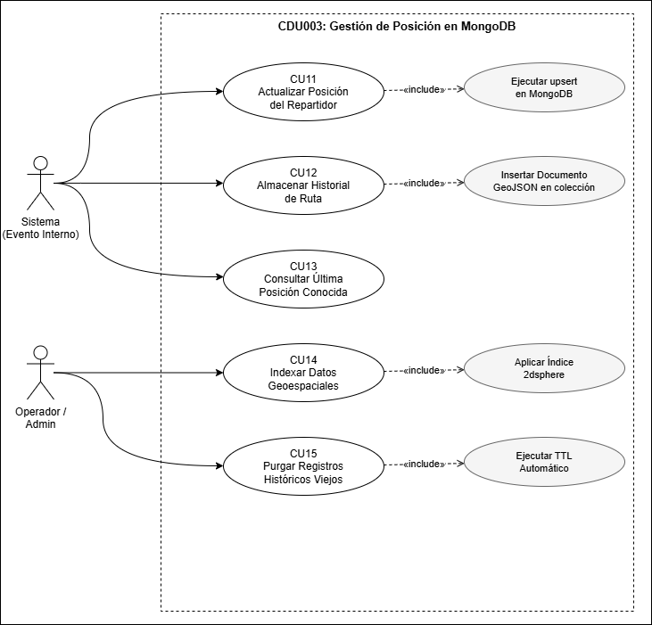

---

# CDU004 — Consulta Médica Virtual (Videollamada)

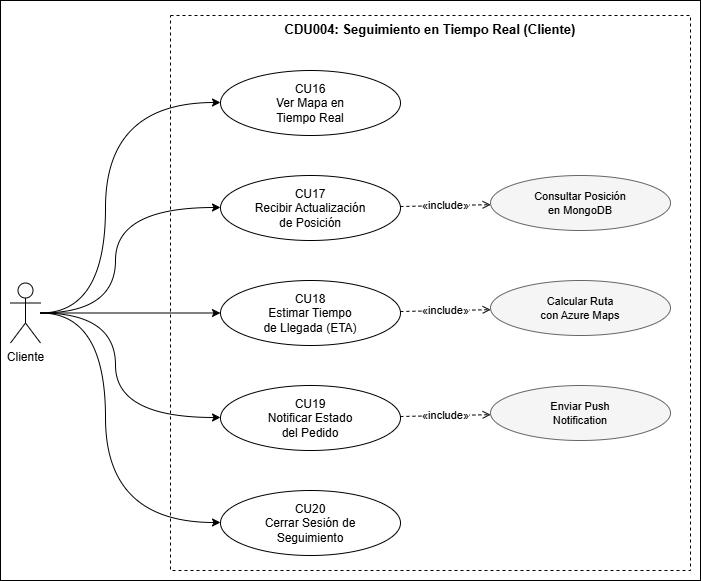

---

# CDU005 — Gestión de Agenda del Especialista

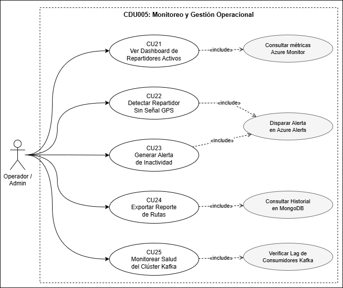

---

# Diagrama de actividades
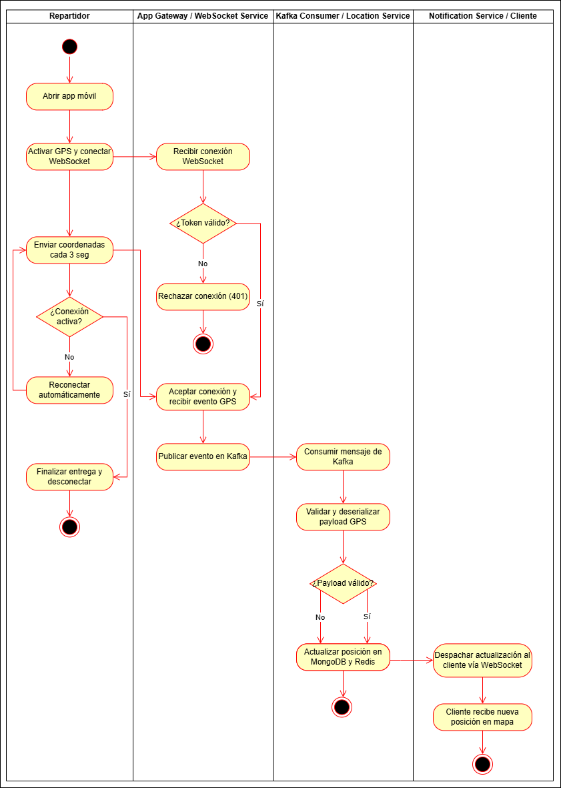

---

# Diagrama de secuencia
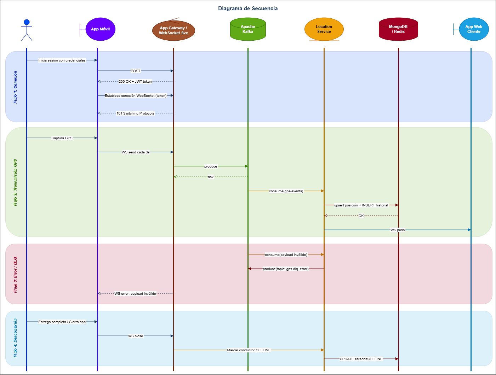

---

# Diagrama de Arquitectura Alto nivel
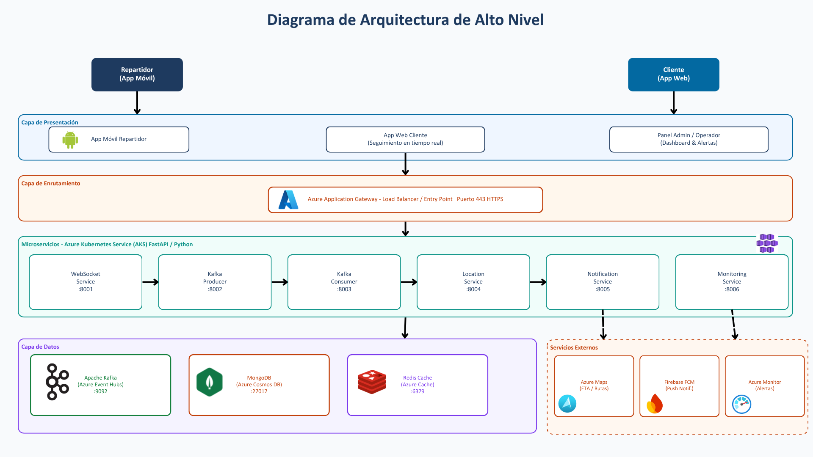

---

# Diagrama de componentes
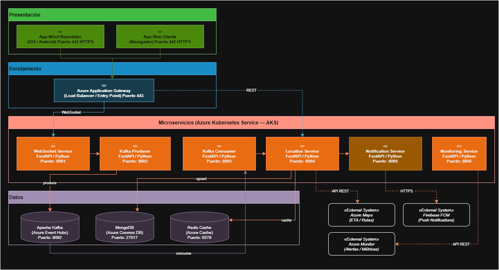

---

# Diagrama de componentes
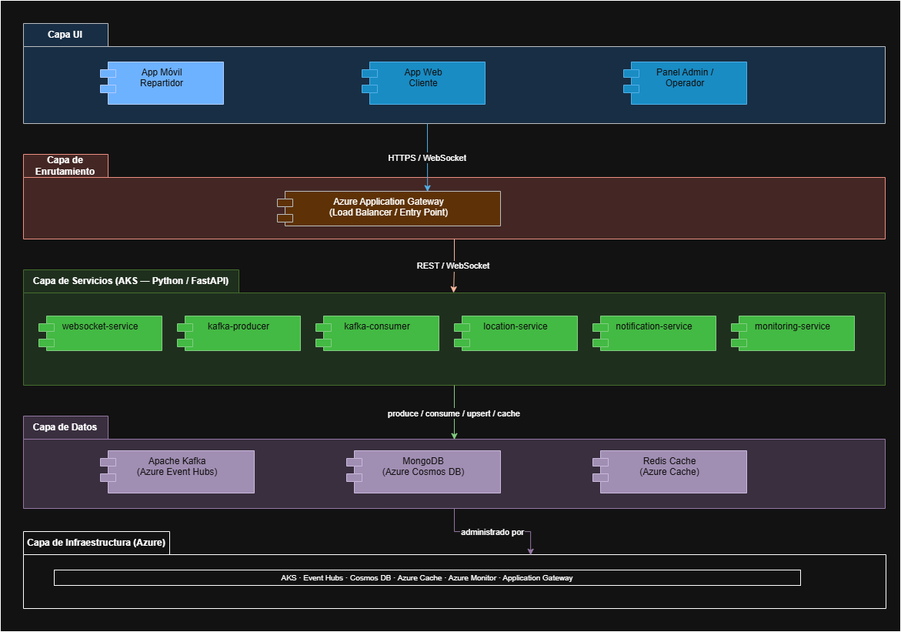

---

# Justificación de tecnologías

## 1. WebSocket

| | |
|---|---|
| **¿Qué?** | Protocolo de comunicación bidireccional y persistente sobre TCP. |
| **¿Por qué?** | Los repartidores necesitan enviar su posición GPS cada 3 segundos de forma continua. HTTP tradicional requeriría abrir y cerrar una conexión nueva en cada envío, lo cual es ineficiente a escala de 10,000 repartidores simultáneos. WebSocket mantiene una sola conexión abierta. |
| **¿Para qué?** | Para que el repartidor transmita sus coordenadas GPS en tiempo real y el cliente reciba las actualizaciones de posición sin necesidad de hacer polling al servidor. |

---

## 2. Apache Kafka (Azure Event Hubs)

| | |
|---|---|
| **¿Qué?** | Plataforma de mensajería distribuida orientada a eventos, basada en un modelo publicador-suscriptor con almacenamiento en tópicos particionados. |
| **¿Por qué?** | Con 10,000 repartidores enviando eventos cada 3 segundos se generan ~3,333 mensajes por segundo. Kafka absorbe esa carga masiva sin saturar los servicios de procesamiento, actúa como buffer y garantiza que ningún evento se pierda aunque el consumidor vaya más lento. |
| **¿Para qué?** | Para desacoplar la ingestión de datos GPS del procesamiento. El WebSocket Service publica eventos y el Kafka Consumer los procesa de forma independiente y escalable. |

---

## 3. FastAPI (Python)

| | |
|---|---|
| **¿Qué?** | Framework web moderno para Python basado en programación asíncrona (async/await) con validación automática de datos mediante Pydantic. |
| **¿Por qué?** | Su naturaleza asíncrona lo hace ideal para manejar miles de conexiones concurrentes sin bloquear el hilo principal. Es significativamente más rápido que Flask o Django para cargas de I/O intensivo como la telemetría GPS. |
| **¿Para qué?** | Para implementar todos los microservicios del backend: WebSocket Service, Kafka Producer/Consumer, Location Service, Notification Service y Monitoring Service. |

---

## 4. MongoDB (Azure Cosmos DB)

| | |
|---|---|
| **¿Qué?** | Base de datos NoSQL orientada a documentos con soporte nativo para datos geoespaciales mediante el tipo GeoJSON y el índice `2dsphere`. |
| **¿Por qué?** | Los datos GPS son inherentemente geoespaciales. MongoDB permite almacenar coordenadas como documentos GeoJSON y ejecutar consultas espaciales (ej. "repartidores dentro de un radio de 2 km") de forma nativa y eficiente. Su esquema flexible también facilita guardar el historial de rutas sin migraciones. |
| **¿Para qué?** | Para persistir la posición actual de cada repartidor (con upsert), almacenar el historial de rutas y servir consultas de posición a los clientes en tiempo real. |

---

## 5. Redis (Azure Cache for Redis)

| | |
|---|---|
| **¿Qué?** | Base de datos en memoria de tipo clave-valor, extremadamente rápida, usada principalmente como caché. |
| **¿Por qué?** | Consultar MongoDB en cada actualización de posición (cada 3 segundos por repartidor) generaría una carga innecesaria sobre la base de datos. Redis almacena la última posición conocida en memoria y responde en microsegundos. |
| **¿Para qué?** | Para cachear la posición más reciente de cada repartidor y servirla a los clientes con latencia mínima, sin golpear MongoDB en cada consulta. |

---

## 6. Azure Application Gateway

| | |
|---|---|
| **¿Qué?** | Balanceador de carga de capa 7 (HTTP/HTTPS/WebSocket) administrado por Microsoft Azure, con soporte para WAF (Web Application Firewall). |
| **¿Por qué?** | El sistema necesita un punto de entrada único que distribuya el tráfico entre los pods del AKS, termine el cifrado TLS y proteja los servicios internos de acceso directo desde internet. |
| **¿Para qué?** | Para recibir todas las conexiones entrantes (HTTPS y WebSocket), distribuirlas entre los microservicios disponibles en AKS y actuar como capa de seguridad perimetral. |

---

## 7. Azure Kubernetes Service (AKS)

| | |
|---|---|
| **¿Qué?** | Servicio administrado de orquestación de contenedores basado en Kubernetes, ofrecido por Microsoft Azure. |
| **¿Por qué?** | Con 10,000 repartidores simultáneos la carga varía a lo largo del día. AKS permite escalar automáticamente el número de pods según la demanda, reiniciar servicios caídos y gestionar el despliegue de nuevas versiones sin tiempo de inactividad. |
| **¿Para qué?** | Para desplegar, escalar y administrar todos los microservicios del backend en contenedores Docker, garantizando alta disponibilidad y escalabilidad horizontal. |

---

## 8. Azure Maps

| | |
|---|---|
| **¿Qué?** | Servicio de mapas y geolocalización de Microsoft Azure que incluye APIs de rutas, geocodificación y cálculo de tiempo estimado de llegada (ETA). |
| **¿Por qué?** | Calcular rutas y ETA desde cero requiere datos de tráfico en tiempo real y algoritmos complejos. Azure Maps provee esta funcionalidad como servicio administrado, integrado nativamente con el ecosistema Azure del proyecto. |
| **¿Para qué?** | Para calcular el tiempo estimado de llegada del repartidor al domicilio del cliente y mostrarlo en la app web de seguimiento. |

---

## 9. Firebase Cloud Messaging (FCM)

| | |
|---|---|
| **¿Qué?** | Servicio de mensajería push multiplataforma de Google, compatible con Android, iOS y navegadores web. |
| **¿Por qué?** | Cuando el cliente no tiene la app abierta, no puede recibir actualizaciones vía WebSocket. FCM permite enviar notificaciones push al dispositivo del cliente aunque la app esté en segundo plano. |
| **¿Para qué?** | Para notificar al cliente sobre cambios de estado de su pedido (ej. "Tu repartidor está a 5 minutos") cuando no está activamente usando la aplicación. |

---

## 10. Azure Monitor

| | |
|---|---|
| **¿Qué?** | Servicio de observabilidad de Microsoft Azure que recopila métricas, logs y trazas de todos los recursos del ecosistema Azure. |
| **¿Por qué?** | Un sistema con 10,000 conexiones simultáneas requiere visibilidad constante sobre el estado de los servicios, el lag de Kafka, el uso de memoria de Redis y la latencia de MongoDB para detectar problemas antes de que afecten a los usuarios. |
| **¿Para qué?** | Para monitorear la salud del clúster Kafka, el rendimiento de los microservicios, disparar alertas automáticas ante anomalías y proveer dashboards operacionales al equipo de operaciones. |