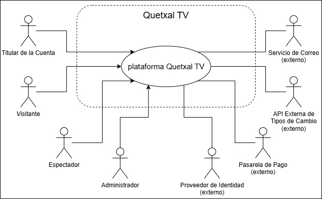
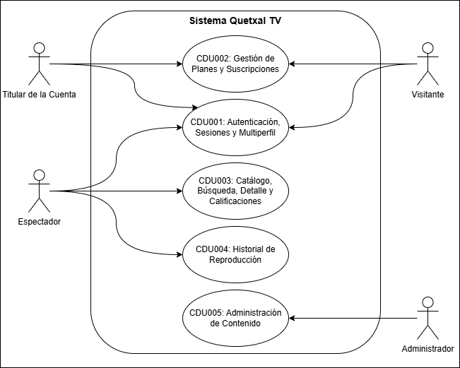
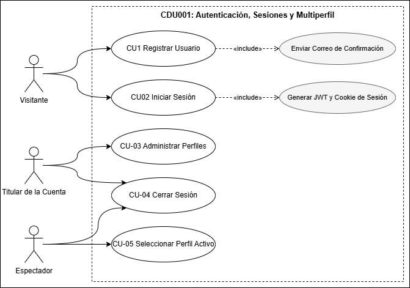

# Quetxal TV - Proyecto fase 1 Grupo 11

##  Integrantes

| Integrante | Nombre | Carnet |  
|---|---|---|
| **1** | Isai Eliezer Magdiel Molina Guevara | 202100179 |   
| **2** | Velveth Nayely Perez Yas | 202010810 | 
| **3** | Diego Rene Chen Teyul | 202202882 |  
| **4** | Néstor Enrique Villatoro Avendaño | 202200252 | 
| **5** | Angel Eduardo Tubac Simón | 202200309 |  

---

# Requerimientos Funcionales y No Funcionales
## Requerimientos Funcionales (RF)
---

### Autenticación, Gestión de Sesiones y Multiperfil

| ID | Requerimiento | Descripción | Prioridad | Métrica / Criterio de Aceptación |
|:---|:---|:---|:---:|:---|
| **RF-001** | Registro de Usuario | Permitir que un nuevo usuario cree una cuenta en la plataforma. | Alta | • Campos obligatorios: nombre, correo, contraseña • Email único en la base de datos • Contraseña ≥ 8 caracteres con al menos 1 número y 1 mayúscula • Hash de contraseña con bcrypt (nunca en texto plano) • Disparo de correo de confirmación de registro (RF-023) |
| **RF-002** | Inicio de Sesión Seguro | Autenticar a un usuario registrado para acceder a la plataforma. | Alta | • Validación de email + contraseña • Emisión de JWT firmado y de Session Cookie segura (`HttpOnly`, `Secure`, `SameSite`) • Mensaje de error genérico ante credenciales inválidas • Bloqueo temporal tras 5 intentos fallidos |
| **RF-003** | Inicio de Sesión con OAuth | Permitir el ingreso mediante delegación de autorización con un proveedor OAuth externo. | Media | • Soporte de al menos un proveedor (ej. Google) • Vinculación con cuenta existente por correo • Creación automática de cuenta si el correo no existe • Manejo de error si el usuario rechaza el consentimiento |
| **RF-004** | Gestión de Sesiones | Controlar el acceso a rutas protegidas mediante el ecosistema de seguridad. | Alta | • JWT con vigencia de 24 h para propagación de identidad service-to-service • Session Cookie segura para mantener el estado en el cliente • Claims: `user_id`, `email`, `plan`, `perfil_activo` • Respuesta 401 ante token vencido o inválido |
| **RF-005** | Cierre de Sesión | Permitir al usuario terminar su sesión de forma segura. | Media | • Invalidación de la Session Cookie en el cliente • Revocación o expiración del JWT vigente • Redirección a la pantalla de inicio de sesión |
| **RF-006** | Crear Perfil | Permitir crear múltiples perfiles dentro de una sola cuenta. | Alta | • Máximo **5 perfiles** por cuenta • Campos: nombre del perfil, avatar, indicador infantil (opcional) • Rechazo con mensaje claro al intentar crear el sexto perfil • Cada perfil con preferencias e historial aislados e independientes |
| **RF-007** | Administrar Perfiles | Permitir editar y eliminar los perfiles de la cuenta. | Media | • Edición de nombre y avatar • Eliminación con modal de confirmación • Al eliminar un perfil se elimina su historial asociado • No se permite eliminar el último perfil de la cuenta |
| **RF-008** | Seleccionar Perfil Activo | Establecer el perfil con el que se navegará la sesión. | Alta | • Selección obligatoria tras el login • El `perfil_activo` viaja en el contexto de la sesión • Catálogo, calificaciones e historial se sirven según el perfil activo • Cambio de perfil sin cerrar sesión |

---

### Gestión de Planes y Suscripciones

| ID | Requerimiento | Descripción | Prioridad | Métrica / Criterio de Aceptación |
|:---|:---|:---|:---:|:---|
| **RF-009** | Visualizar Planes | Mostrar los planes de suscripción disponibles con su detalle técnico. | Alta | • Planes mínimos: Básico, Estándar, Premium • Cada plan muestra: nombre, precio, resolución máxima, número de pantallas simultáneas • Precio mostrado en la moneda local del usuario vía FX-Service (RF-019) • Indicador visual del plan actualmente contratado |
| **RF-010** | Contratar / Seleccionar Plan | Permitir al usuario adquirir o cambiar a un plan de suscripción. | Alta | • Registro transaccional de la compra mediante procedimiento almacenado • Generación de recibo y disparo de correo (RF-024) • Activación inmediata de los beneficios del plan • Validación de que el usuario esté autenticado |
| **RF-011** | Modificar Suscripción | Permitir cambiar de un plan a otro desde el panel de cuenta. | Media | • Cambio de plan reflejado en la fecha del siguiente ciclo • Recalculo del precio en moneda local • Confirmación visual del cambio guardado • Registro del cambio en bitácora de la cuenta |
| **RF-012** | Cancelar Suscripción | Permitir al usuario cancelar su suscripción activa. | Media | • Modal de confirmación antes de cancelar • Acceso mantenido hasta el final del ciclo pagado • Cambio de estado de la cuenta a "cancelada" • Posibilidad de reactivar antes del fin del ciclo |
| **RF-013** | Actualizar Credenciales de Acceso | Permitir modificar el correo y la contraseña de la cuenta. | Media | • Reautenticación previa al cambio de credenciales • Validación de la nueva contraseña (mismas reglas que RF-001) • Registro automático del cambio mediante trigger de auditoría • Notificación por correo al detectar el cambio |

---

### Catálogo, Búsqueda y Detalle de Contenido

| ID | Requerimiento | Descripción | Prioridad | Métrica / Criterio de Aceptación |
|:---|:---|:---|:---:|:---|
| **RF-014** | Ver Catálogo | Mostrar la cartelera de películas y series disponibles. | Alta | • Cartelera armada mediante **vista** de base de datos • Cada ítem muestra: título, póster, género, año, % de recomendación (RF-018) • Segmentación por categorías (ej. Tendencias, Estrenos, Originales) • Carga inicial en < 2 segundos |
| **RF-015** | Búsqueda Avanzada y Filtrado | Permitir buscar y filtrar contenido del catálogo. | Alta | • Búsqueda por título (coincidencia parcial) • Filtros combinables: categoría, género y título • Resultados actualizados al escribir • Mensaje claro cuando no hay resultados |
| **RF-016** | Ver Detalle de Contenido | Mostrar la ficha completa de una película o serie. | Alta | • Datos: título, sinopsis, año, duración/temporadas, clasificación, género • Ficha técnica y lista de actores/reparto (servida mediante vista) • % global de recomendación visible • Botón directo para reproducir o reanudar (RF-022) |

---

### Sistema de Calificaciones Dinámico

| ID | Requerimiento | Descripción | Prioridad | Métrica / Criterio de Aceptación |
|:---|:---|:---|:---:|:---|
| **RF-017** | Calificar Contenido | Permitir al perfil calificar el contenido visto. | Alta | • Sistema por estrellas o de recomendación (pulgar arriba/abajo) • Una calificación por perfil y por contenido (editable) • La calificación se asocia al perfil activo, no a la cuenta • Registro persistido en la base del servicio de calificaciones |
| **RF-018** | Porcentaje Global de Recomendación | Mostrar el % de recomendación de cada contenido calculado a partir de la comunidad. | Alta | • Cálculo dinámico mediante **función** de base de datos • Se actualiza al registrarse nuevas calificaciones • Visible en la vista de catálogo y en el detalle del contenido • Manejo del caso "sin calificaciones aún" |

---

### Servicio Financiero FX-Service con Redis Cache

| ID | Requerimiento | Descripción | Prioridad | Métrica / Criterio de Aceptación |
|:---|:---|:---|:---:|:---|
| **RF-019** | Conversión de Precios a Moneda Local | Mostrar el costo de los planes en la moneda local del usuario. | Alta | • Microservicio dedicado consulta tipos de cambio desde una API externa • Conversión aplicada al precio base de cada plan • Detección o selección de la moneda local del usuario • Fallback a moneda base si la conversión no está disponible |
| **RF-020** | Caché de Tipos de Cambio (Redis) | Cachear los tipos de cambio para evitar consultas repetitivas a la API externa. | Alta | • Implementación obligatoria de caché con **Redis** • Política de expiración **TTL** configurable por variable de entorno • Lectura desde caché antes de invocar la API externa (cache-aside) • Refresco automático del valor al vencer el TTL |

---

### Historial de Reproducción Reciente

| ID | Requerimiento | Descripción | Prioridad | Métrica / Criterio de Aceptación |
|:---|:---|:---|:---:|:---|
| **RF-021** | Registrar Progreso de Visualización | Almacenar el avance de reproducción de cada perfil. | Alta | • Progreso registrado y aislado por perfil • Actualización periódica del punto de avance durante la reproducción • Persistencia inmediata al pausar o salir del contenido • Listado de "Continuar viendo" en la pantalla principal |
| **RF-022** | Reanudación de Contenido | Permitir reanudar la reproducción desde el punto exacto donde se detuvo. | Alta | • Para películas: minuto exacto de detención • Para series: **temporada, capítulo y minuto** exactos • Reanudación inmediata al volver al contenido • Marcado de contenido como "visto" al finalizar |

---

### Sistema de Notificaciones por Correo

| ID | Requerimiento | Descripción | Prioridad | Métrica / Criterio de Aceptación |
|:---|:---|:---|:---:|:---|
| **RF-023** | Correo de Confirmación de Registro | Enviar un correo automático tras el registro de un usuario. | Alta | • Envío automático al completarse el registro (RF-001) • Contenido: bienvenida y confirmación de la cuenta • Envío asíncrono que no bloquea el flujo de registro • Reintento ante fallo de envío |
| **RF-024** | Recibo de Compra por Correo | Enviar el recibo tras la contratación o cambio de plan. | Alta | • Disparo al confirmarse el pago/contratación (RF-010) • Contenido: plan adquirido, monto en moneda local y fecha • Envío asíncrono e idempotente (un solo recibo por transacción) • Registro del envío en bitácora del servicio |
| **RF-025** | Alertas de Nuevo Contenido | Notificar a los usuarios sobre nuevas publicaciones de contenido. | Baja | • Correo automático al publicarse nuevo contenido • Respeto a las preferencias de notificación del usuario • Envío masivo desacoplado y asíncrono • Enlace directo al detalle del contenido |

---

## Requerimientos No Funcionales (RNF)

---

### Seguridad

| ID | Requerimiento | Descripción | Métrica / Criterio de Aceptación |
|:---|:---|:---|:---|
| **RNF-001** | Punto de Entrada Único (API Gateway) | Ningún cliente externo puede comunicarse directamente con los microservicios. | • Todo el tráfico externo pasa obligatoriamente por el API Gateway • El Gateway intercepta peticiones, valida la sesión y enruta el tráfico • Los microservicios no exponen puertos públicos hacia internet • Bloqueo de cualquier acceso directo a un microservicio interno |
| **RNF-002** | Propagación de Identidad con JWT | Comunicación segura de identidad entre servicios. | • JWT firmado para propagación service-to-service • Algoritmo HS256 (o RS256) con secret/clave en variable de entorno • Expiración configurable (default 24 h) • Validación del token en cada servicio que recibe la petición |
| **RNF-003** | Session Cookies Seguras | Mantenimiento seguro del estado en el cliente. | • Cookies con flags `HttpOnly`, `Secure` y `SameSite` • Transmisión únicamente sobre HTTPS • Sin información sensible en el cuerpo de la cookie • Expiración alineada con la sesión del usuario |
| **RNF-004** | Encriptación de Contraseñas | Almacenamiento seguro de credenciales. | • Hash con bcrypt (cost factor 10–12) • Contraseñas nunca almacenadas en texto plano • El campo password nunca se retorna en respuestas JSON • Reglas de complejidad mínimas aplicadas en servidor |
| **RNF-005** | Validación y Sanitización de Inputs | Prevención de inyección y datos maliciosos. | • Prevención de SQL Injection en todos los servicios • Validación de tipos de datos en servidor (no solo en cliente) • Rechazo de payloads malformados con respuesta 400 • Escape de caracteres especiales en campos de texto |
| **RNF-006** | Gestión de Secretos con `.env` | Toda información sensible debe externalizarse y no versionarse. | • Uso obligatorio de archivos `.env` para URLs, contraseñas, IPs y claves • `.env` excluido del repositorio mediante `.gitignore` • `.env.example` versionado con valores de ejemplo • Ningún valor sensible hardcodeado en el código fuente |

---

### Arquitectura de Microservicios

| ID | Requerimiento | Descripción | Métrica / Criterio de Aceptación |
|:---|:---|:---|:---|
| **RNF-007** | Backend Políglota | Los microservicios deben implementarse simultáneamente en tres lenguajes. | • Uso obligatorio y simultáneo de **TypeScript, Go y Python** • Distribución de lenguajes según el dominio de cada microservicio • Cada lenguaje presente en al menos un microservicio del backend • Justificación de la asignación documentada en la vista de arquitectura |
| **RNF-008** | Database per Microservice | Cada dominio es un microservicio autónomo con su propia base de datos. | • Una base de datos independiente por microservicio • Ningún servicio accede directamente a la base de datos de otro • El intercambio de datos ocurre exclusivamente vía gRPC • Cada servicio es desplegable de forma independiente |
| **RNF-009** | Comunicación Interna vía gRPC | Toda comunicación service-to-service es síncrona y directa por gRPC. | • Comunicación interna exclusivamente mediante el protocolo gRPC • Sin llamadas REST internas entre microservicios • Manejo de errores y códigos de estado gRPC estandarizados • Timeouts definidos por llamada |
| **RNF-010** | Contratos Estrictos (Protocol Buffers) | Definición de contratos formales entre servicios políglotas. | • Definición de servicios y mensajes en archivos `.proto` • Generación de stubs para TypeScript, Go y Python desde el mismo contrato • Contratos versionados y almacenados en el repositorio • Cambios de contrato compatibles hacia atrás cuando sea posible |

---

### Rendimiento y Escalabilidad

| ID | Requerimiento | Descripción | Métrica / Criterio de Aceptación |
|:---|:---|:---|:---|
| **RNF-011** | Caché con Redis y Política TTL | Reducir la latencia y evitar consultas externas repetitivas. | • Capa de caché Redis para los tipos de cambio del FX-Service • Política TTL configurable por variable de entorno • Estrategia cache-aside (lectura de caché antes de la fuente) • Redis desplegado en contenedor independiente |
| **RNF-012** | Tiempo de Respuesta | Latencia aceptable en las operaciones del sistema. | • Endpoints de lectura simples (catálogo, perfil): < 500 ms • Búsquedas con filtros: < 1 s • Conversión FX con caché caliente: < 200 ms • Medido bajo carga de usuarios concurrentes |
| **RNF-013** | Escalabilidad Horizontal | El sistema debe poder escalar por servicio sin afectar a los demás. | • Cada microservicio es escalable de forma independiente • Servicios sin estado (stateless) salvo la capa de caché/BD • El API Gateway distribuye el tráfico hacia las instancias • Sin dependencias que impidan ejecutar múltiples réplicas |

---

### Persistencia y Programación en Base de Datos

| ID | Requerimiento | Descripción | Métrica / Criterio de Aceptación |
|:---|:---|:---|:---|
| **RNF-014** | Procedimientos Almacenados | Lógica transaccional compleja delegada al motor de datos. | • Implementación obligatoria de procedimientos almacenados • Uso en flujos transaccionales (ej. registro unificado de una compra) • Documentación de qué componente usa cada procedimiento • Manejo de transacciones atómicas (commit/rollback) |
| **RNF-015** | Vistas | Simplificación del armado de consultas de lectura. | • Implementación obligatoria de vistas • Uso para el armado de la cartelera y las fichas de actores/reparto • Vistas documentadas en el diagrama Entidad-Relación • Consultas de catálogo apoyadas en vistas en lugar de joins ad-hoc |
| **RNF-016** | Funciones | Operaciones lógicas modulares en el motor de datos. | • Implementación obligatoria de funciones • Uso para el cálculo del % de recomendación de contenidos • Funciones reutilizables e idempotentes • Documentadas con sus parámetros de entrada y salida |
| **RNF-017** | Triggers | Auditoría automática de eventos sensibles. | • Implementación obligatoria de triggers • Uso para auditoría (ej. registro de cambios de credenciales) • Registro automático de fecha, usuario y dato modificado • Triggers documentados en el diagrama Entidad-Relación |

---

### Mantenibilidad y Calidad del Código

| ID | Requerimiento | Descripción | Métrica / Criterio de Aceptación |
|:---|:---|:---|:---|
| **RNF-018** | Principios SOLID | Código mantenible, escalable y ordenado. | • Aplicación de los principios SOLID en todos los microservicios • Separación de responsabilidades por capas (controlador, servicio, repositorio) • Sin lógica de negocio duplicada entre servicios • Nombres y estructura de proyecto consistentes por lenguaje |
| **RNF-019** | Gobierno de Código (Pull Requests) | Flujo de trabajo profesional sobre el repositorio. | • Commits directos a `main` y `develop` estrictamente prohibidos • Todo cambio se integra mediante Pull Request • Cada PR requiere revisión y aprobación del equipo antes del merge • Trabajo organizado en ramas de feature por integrante |
| **RNF-020** | Versionado del Repositorio | Entrega identificable mediante etiqueta de versión. | • Tag anotado **V1.0.0** creado desde `main` tras el merge final • Tag publicado en el repositorio remoto (GitHub) • Nombre del repositorio según convención `SA_PROYECTO_GX` • Colaborador agregado al repositorio |

---

### Despliegue, Contenedores e Infraestructura

| ID | Requerimiento | Descripción | Métrica / Criterio de Aceptación |
|:---|:---|:---|:---|
| **RNF-021** | Contenedorización por Componente | Cada pieza del sistema debe ser contenedorizable. | • Dockerfile propio por cada microservicio, base de datos, caché y API Gateway • Imagen base ligera (Alpine preferido) • Variables de entorno externalizadas (no hardcodeadas en la imagen) • Build exitoso sin errores en ambiente limpio |
| **RNF-022** | Orquestación con Docker Compose | Toda la topología debe inicializarse de forma automatizada. | • Levantamiento completo del sistema mediante Docker Compose • Health checks definidos para bases de datos y Redis • Dependencias entre servicios declaradas en el orden de arranque • Un solo comando levanta toda la topología |
| **RNF-023** | Entorno Local | Configuración de Docker Compose para desarrollo local. | • Archivo `docker-compose.local.yml` • Orientado a pruebas de desarrollo en la máquina local • Variables de entorno en archivo `.env` • Funciona sin configuración adicional tras clonar el repositorio |
| **RNF-024** | Entorno en la Nube (GCP) | Configuración de Docker Compose para producción en la nube. | • Archivo `docker-compose.cloud.yml` • Variables de entorno de producción, volúmenes remotos y políticas de reinicio • Despliegue obligatorio en **Google Cloud Platform** • Solo se califican funcionalidades desplegadas en la nube |
| **RNF-025** | Tolerancia a Fallos | El sistema debe recuperarse ante fallos parciales. | • Políticas de reinicio (`restart`) configuradas en el entorno cloud • La caída de un microservicio no derriba toda la plataforma • Reintentos en llamadas gRPC ante fallos transitorios • Recuperación automática del estado tras reinicio de un servicio |

---

# Modelo de Casos de Uso (UML)

## Actores del Sistema

### Actores Primarios

> Inician los casos de uso. Interactúan directamente con la plataforma a través del API Gateway.

| Actor | Qué hace | RF que cubre |
|:---|:---|:---|
| **Visitante** (Usuario No Registrado) | Acciones previas a tener sesión: registrarse, iniciar sesión (incluido el inicio de sesión con OAuth) y consultar los planes disponibles antes de suscribirse. | RF-001, RF-002, RF-003, RF-009 |
| **Titular de la Cuenta** (Suscriptor) | Operaciones a nivel de **cuenta** autenticada: crear y administrar perfiles (máximo 5), contratar/modificar/cancelar la suscripción, actualizar credenciales y cerrar sesión. | RF-005, RF-006, RF-007, RF-010, RF-011, RF-012, RF-013 |
| **Espectador** (Perfil) | Operaciones a nivel del **perfil activo**: seleccionar perfil, explorar/buscar/filtrar el catálogo, ver el detalle de un contenido y su % de recomendación, calificarlo, registrar el progreso y reanudar la reproducción. | RF-008, RF-014, RF-015, RF-016, RF-017, RF-018, RF-021, RF-022 |
| **Administrador** (Gestor de Contenido) | Gestión del catálogo: alta/edición/baja de películas y series, mantenimiento de fichas técnicas y reparto, y publicación de contenido nuevo (que dispara las alertas por correo). | Soporta RF-014, RF-016, RF-025 |

### Actores Secundarios

> Sistemas externos. No inician casos de uso, pero la plataforma depende de ellos para completarlos.

| Actor | Qué hace / Rol | RF que soporta |
|:---|:---|:---|
| **Proveedor de Identidad OAuth** (ej. Google) | Sistema externo que responde la delegación de autorización durante el inicio de sesión con OAuth y devuelve la identidad verificada del usuario. | RF-003 |
| **Pasarela de Pago** | Sistema externo que procesa el cobro al contratar o cambiar de plan y confirma o rechaza la transacción. | RF-010, RF-011 |
| **API Externa de Tipos de Cambio** | Sistema externo consultado por el FX-Service para obtener las divisas; su respuesta se almacena en la caché Redis con política TTL. | RF-019, RF-020 |
| **Servicio de Correo (SMTP)** | Sistema externo que recibe y entrega los correos de confirmación de registro, recibos de compra y alertas de contenido nuevo. | RF-023, RF-024, RF-025 |

---

## Diagrama de Casos de Uso de Alto Nivel

## Diagrama de primera descomposición 

## casos de uso expandidos

### CDU001: Autenticación, Sesiones y Multiperfil
 